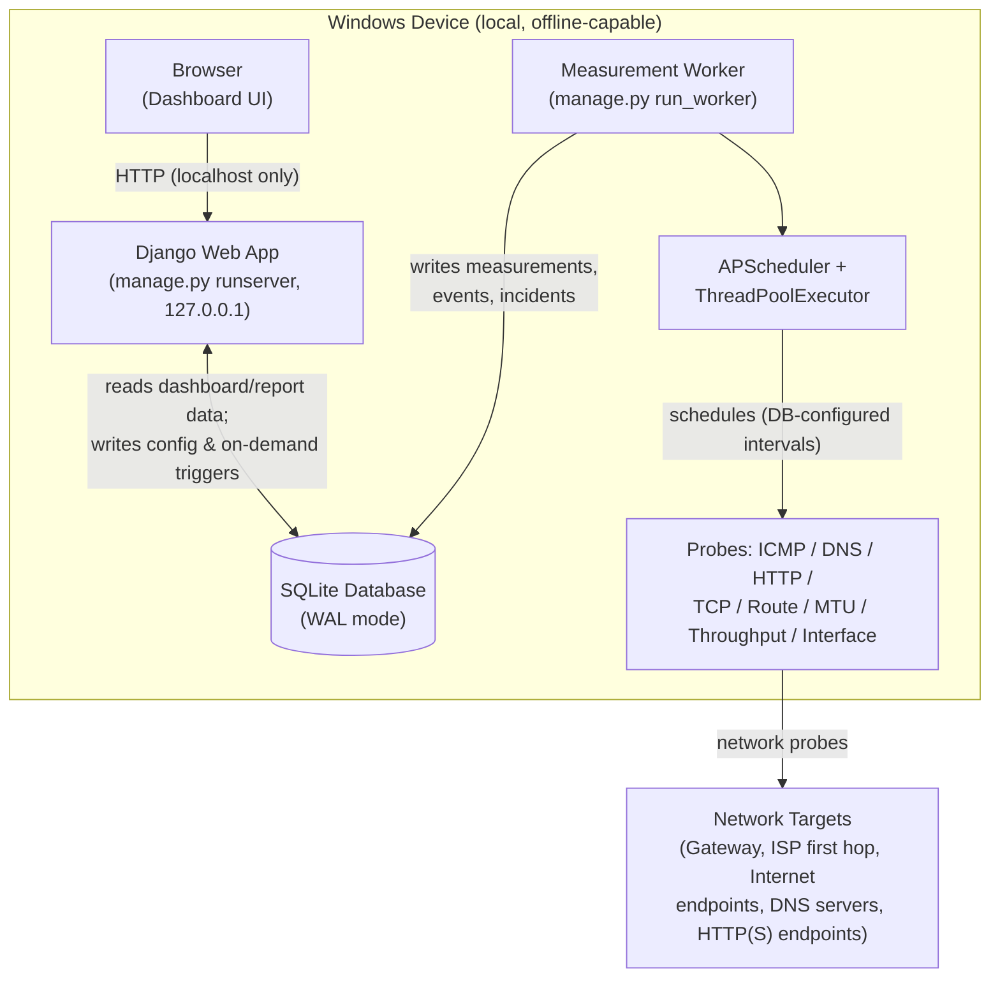

# Architecture Overview

## Goal

A local-first Windows application that continuously measures ISP/network quality, remains fully
functional (dashboard + data collection) when the Internet is unavailable, and evaluates measured
behavior against both user-configured SLA contracts and versioned industry baselines.

## Process model

The system is deliberately split into two independent OS processes that only communicate through the
shared local database — neither process depends on the other being alive:

- **Django web application** (`manage.py runserver`, bound to `127.0.0.1` only) — dashboard, config
  UI, report viewing/download, polling JSON endpoints. Never runs probes itself.
- **Measurement worker** (`manage.py run_worker`) — a standalone management command hosting an
  APScheduler instance + thread pool that runs all network probes on DB-configured schedules and
  writes results straight to the database. Started manually by the user (see
  [DECISIONS.md](DECISIONS.md) for why a Windows Service was not chosen).

This decoupling is what satisfies the requirement that the dashboard and data collection keep working
independently, and that probes never block a web request.

## Components

Editable source: [diagrams/architecture-overview.drawio](diagrams/architecture-overview.drawio).

### Django apps

| App | Responsibility |
|---|---|
| `core` | `Target`, `ScheduleConfig`, `RetentionPolicy` — all user-configurable, no hard-coded values |
| `measurements` | Models for every probe category + probe implementations (called by the worker) |
| `network_state` | Connectivity state machine (`ONLINE`/`DEGRADED`/`OFFLINE`/`RECOVERING`) |
| `incidents` | Derives `Event`s from state transitions/thresholds, correlates them into `Incident`s |
| `sla` | `SLARule` CRUD + evaluation engine |
| `baselines` | Versioned `Baseline` reference data + comparison views |
| `reports` | Report generation (HTML/PDF/CSV/JSON) |
| `dashboard` | Views, templates, polling JSON endpoints, historical graphs |

The `worker/` package (a management command, not a Django "app" with models) hosts the scheduler and
calls into `apps.measurements` probe implementations.

## Offline operation

- Django binds to `127.0.0.1` only — the dashboard is served locally and never needs a WAN link.
- All static assets (Chart.js, any JS/CSS) are vendored into the repo, never loaded from a CDN, so the
  UI renders fully offline.
- The worker keeps scheduling and running probes regardless of Internet state — probe *failures* are
  exactly how outages are detected and recorded, not a reason to stop the worker.
- SQLite lives on local disk in WAL mode; both processes can safely read/write concurrently (see
  [DATA_MODEL.md](DATA_MODEL.md#concurrency)).
- Reports are generated entirely from local DB + local templates — no network call is ever part of the
  reporting pipeline.
- Industry baselines are seeded once via a Django data migration/fixture — no runtime fetch is needed.

## Non-blocking measurement collection

See [WORKER_AND_SCHEDULING.md](WORKER_AND_SCHEDULING.md) for full detail. Summary: the worker runs an
APScheduler instance with a `ThreadPoolExecutor`; each probe job runs on a worker thread, writes its
result via the Django ORM, and cheaply evaluates state-machine transitions inline. The Django request/
response cycle never touches probe code — it only reads measurement rows or writes a lightweight
"on-demand test requested" row that the worker picks up on its next scheduling tick.

## Elevation / admin rights

Full-fidelity ICMP (raw sockets) and some interface statistics require the worker process to run
elevated. The dashboard must detect and surface elevation status so users understand why some metrics
may be degraded when not running as Administrator (see [DECISIONS.md](DECISIONS.md)).
