# Data Model

All models use standard Django field types and explicit foreign keys (no SQLite-only tricks), so a
future migration to PostgreSQL is a settings change + data migration, not a redesign.

## Concurrency

The Django web process and the measurement worker process share one SQLite file:

- `PRAGMA journal_mode=WAL` set via a `connection_created` signal so readers (web) don't block writers
  (worker), and vice versa.
- `DATABASES['default']['OPTIONS']['timeout']` (busy timeout) set generously (e.g. 20s) so transient
  lock contention retries instead of raising `OperationalError`.
- Write transactions are kept short — a probe job writes one row (plus, occasionally, a state
  transition/event row) and commits immediately.
- The web process is a reader for almost everything; its only writes are config changes (`Target`,
  `ScheduleConfig`, `SLARule`, `RetentionPolicy` edits via admin/UI) and on-demand test request rows.

## Entity overview

```mermaid
erDiagram
    TARGET ||--o{ ICMP_MEASUREMENT : probed_for
    TARGET ||--o{ DNS_MEASUREMENT : probed_for
    TARGET ||--o{ HTTP_MEASUREMENT : probed_for
    TARGET ||--o{ TCP_MEASUREMENT : probed_for
    TARGET ||--o{ THROUGHPUT_MEASUREMENT : probed_for
    TARGET ||--o{ ROUTE_TEST_RUN : probed_for
    TARGET ||--o{ MTU_TEST_RESULT : probed_for
    ROUTE_TEST_RUN ||--o{ ROUTE_HOP : contains
    ROUTE_TEST_RUN ||--o{ ROUTE_CHANGE_EVENT : "compared to previous run"

    NETWORK_STATE_LOG }o--|| EVENT : "may trigger"
    EVENT }o--|| INCIDENT : "grouped into"
    EVENT ||--o{ EVENT_EVIDENCE : "backed by"
    INCIDENT ||--o| REPORT : generates
    SLA_RULE ||--o{ SLA_EVALUATION : evaluated_as
    INCIDENT ||--o{ SLA_EVALUATION : "evaluated against"

    TARGET {
        int id PK
        string name
        string category "gateway|isp_hop|internet|dns|http|custom"
        string address
        string address_family "ipv4|ipv6"
        string protocol
        bool enabled
    }
    SCHEDULE_CONFIG {
        int id PK
        string task_type
        int interval_seconds
        bool enabled
        datetime last_run
    }
    RETENTION_POLICY {
        int id PK
        string data_type
        int raw_retention_days
        int aggregate_retention_days
    }
    ICMP_MEASUREMENT {
        int id PK
        int target_id FK
        datetime timestamp
        string address_family
        int sent
        int received
        float loss_pct
        float min_rtt_ms
        float avg_rtt_ms
        float median_rtt_ms
        float max_rtt_ms
        float p95_rtt_ms
        float p99_rtt_ms
        float jitter_ms
    }
    DNS_MEASUREMENT {
        int id PK
        int target_id FK
        datetime timestamp
        string resolver
        string query_name
        string query_type
        float resolution_time_ms
        string result_type "success|timeout|servfail|nxdomain"
        string resolved_ip
        string address_family
    }
    HTTP_MEASUREMENT {
        int id PK
        int target_id FK
        datetime timestamp
        float dns_time_ms
        float connect_time_ms
        float tls_time_ms
        float ttfb_ms
        float total_time_ms
        int status_code
        int redirect_count
        string address_family
        string error_type
    }
    TCP_MEASUREMENT {
        int id PK
        int target_id FK
        datetime timestamp
        int port
        bool success
        string error_type
        float connect_time_ms
    }
    THROUGHPUT_MEASUREMENT {
        int id PK
        int target_id FK
        datetime timestamp
        string test_type "download|upload|bidirectional"
        float mbps_down
        float mbps_up
        float avg_mbps
        float peak_mbps
        float min_mbps
        float variance
        float duration_s
        string endpoint
        string address_family
        int test_size_bytes
    }
    BUFFERBLOAT_TEST {
        int id PK
        datetime timestamp
        float baseline_rtt_ms
        float loaded_rtt_download_ms
        float loaded_rtt_upload_ms
        float loaded_rtt_bidirectional_ms
        float loss_during_load_pct
        float throughput_during_load_mbps
        float recovery_time_s
        string classification
    }
    ROUTE_TEST_RUN {
        int id PK
        int target_id FK
        datetime timestamp
        string address_family
    }
    ROUTE_HOP {
        int id PK
        int route_test_run_id FK
        int hop_number
        string ip_address
        string hostname
        float rtt_ms
        bool timeout
    }
    ROUTE_CHANGE_EVENT {
        int id PK
        int target_id FK
        datetime timestamp
        string previous_route_hash
        string new_route_hash
        int hop_count_before
        int hop_count_after
        bool first_hop_changed
    }
    MTU_TEST_RESULT {
        int id PK
        int target_id FK
        datetime timestamp
        int largest_successful_size
        string df_behavior
        string pmtud_response
        int failure_threshold
    }
    INTERFACE_METRIC {
        int id PK
        datetime timestamp
        string interface_name
        string state
        int link_speed_mbps
        bigint bytes_sent
        bigint bytes_received
        bigint packets_sent
        bigint packets_received
        int errors_in
        int errors_out
        int discards
    }
    NETWORK_STATE_LOG {
        int id PK
        datetime timestamp
        string previous_state
        string new_state
        string reason
        json confirming_targets
    }
    EVENT {
        int id PK
        int incident_id FK "nullable"
        string type "OUTAGE|MICRO_OUTAGE|PACKET_LOSS|..."
        datetime start_time
        datetime end_time
        string severity
        text description
    }
    EVENT_EVIDENCE {
        int id PK
        int event_id FK
        string measurement_type "table name, not a real FK"
        int measurement_id
    }
    INCIDENT {
        int id PK
        string type
        datetime start_time
        datetime end_time
        int duration_seconds
        string severity
        json affected_tests
        json affected_destinations
        string recovery_status
        int report_id FK "nullable"
    }
    SLA_RULE {
        int id PK
        string name
        string metric
        string operator
        float threshold
        string unit
        int min_duration_seconds
        int measurement_window_seconds
        string protocol
        string destination_filter
        string time_period_filter
        string severity
        bool enabled
    }
    SLA_EVALUATION {
        int id PK
        int rule_id FK
        int incident_id FK "nullable"
        datetime window_start
        datetime window_end
        float observed_value
        float threshold_value
        string status "satisfied|breached|insufficient_data"
        json evidence
    }
    BASELINE {
        int id PK
        string metric
        float value
        string unit
        string population_context
        string technology_type
        string geographic_scope
        string source
        string source_url
        date publication_date
        text methodology
        text notes
        int version
    }
    REPORT {
        int id PK
        int incident_id FK "nullable"
        string type "outage|periodic|custom"
        string format "html|pdf|csv|json"
        datetime generated_at
        string file_path
        datetime period_start
        datetime period_end
    }
    HOURLY_AGGREGATE {
        int id PK
        int target_id FK "nullable"
        string metric
        datetime period_start
        float avg_value
        float min_value
        float max_value
        float p95_value
        int sample_count
    }
    DAILY_AGGREGATE {
        int id PK
        int target_id FK "nullable"
        string metric
        date period_start
        float avg_value
        float min_value
        float max_value
        float p95_value
        int sample_count
    }
```

Editable high-level (app-grouped) source diagram: [diagrams/er-overview.drawio](diagrams/er-overview.drawio).

## Notes

- `EVENT_EVIDENCE` intentionally stores `measurement_type` (table identifier) + `measurement_id`
  instead of a Django `GenericForeignKey`, so evidence linkage stays simple, indexable, and portable to
  PostgreSQL without relying on Django's `contenttypes` framework.
- `Baseline` has no FK relationship to measurements — comparisons are computed at query/report time by
  matching on `metric` (+ optional `technology_type`/`geographic_scope`), keeping baselines fully
  decoupled from contractual SLA data per requirement §23.
- `HourlyAggregate`/`DailyAggregate` are generic (metric name + optional target) rather than one table
  per measurement category, to avoid a combinatorial explosion of near-identical aggregate tables.
- Raw measurement tables are never aggregated-and-deleted without an explicit `RetentionPolicy`; incidents
  and `SLA_EVALUATION` rows are exempt from retention deletion regardless of policy (§31).
