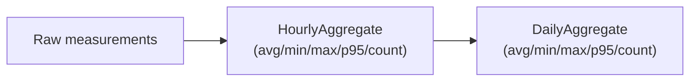

# Reporting, Retention & Export

## Report generation pipeline

All report formats are generated **entirely from local data and local templates** — no network access
is part of this pipeline, satisfying the offline requirement.

| Format | Mechanism |
|---|---|
| HTML | Django templates rendered against `Incident`/measurement queryset context |
| PDF | Rendered HTML piped through xhtml2pdf/reportlab (pure Python, no native GTK dependency) |
| CSV | Python stdlib `csv` module over raw measurement/incident querysets |
| JSON | Python stdlib `json` (or DRF serializers if a REST layer exists) for machine-readable archival |

An outage report (§26) includes: summary (incident id/start/end/duration/detected & recovery state),
connectivity evidence (gateway/ISP-hop/Internet/IPv4/IPv6 results), performance before/during the
outage, recovery detail, and SLA evaluation results with clearly labeled uncertainty.

Reports are automatically generated when an incident closes (see
[STATE_MACHINE_AND_INCIDENTS.md](STATE_MACHINE_AND_INCIDENTS.md#incident-lifecycle)) and linked from
the dashboard's incident view. Users can also generate custom-period reports on demand.

## Historical & industry/SLA comparison views

- **Historical comparison** (§28): current period vs. previous period (today vs yesterday, this week vs
  last week, custom vs custom) across uptime, outages, latency, loss, jitter, throughput, DNS, route
  changes — always showing underlying data, never collapsed into a single score.
- **Industry comparison** (§29) and **SLA comparison** (§30): see
  [SLA_AND_BASELINES.md](SLA_AND_BASELINES.md) — kept as separate views/tables, never merged.

## Retention & aggregation

`RetentionPolicy` (per data type) configures how long raw rows are kept (e.g. 7/30/90/365 days /
indefinite). Nothing is deleted without an explicit policy. Older raw data is rolled up rather than
simply dropped:

`Incident` and `SLA_EVALUATION` rows are **exempt from retention deletion** regardless of policy — the
evidentiary record for SLA/incident purposes is preserved even if raw measurement rows supporting it
have since been aggregated or pruned.

## Export

Bulk export of historical measurements and incidents is available in CSV and JSON, independent of the
report pipeline (a report is a curated document; an export is a raw data dump for external analysis).

> Note: [Requirements.md](../Requirements.md) §32 ("Export") is truncated in the source file after
> "Allow exports" — the scope above is inferred from §2/§27 and should be revisited if more detail
> becomes available. See [DECISIONS.md](DECISIONS.md).
