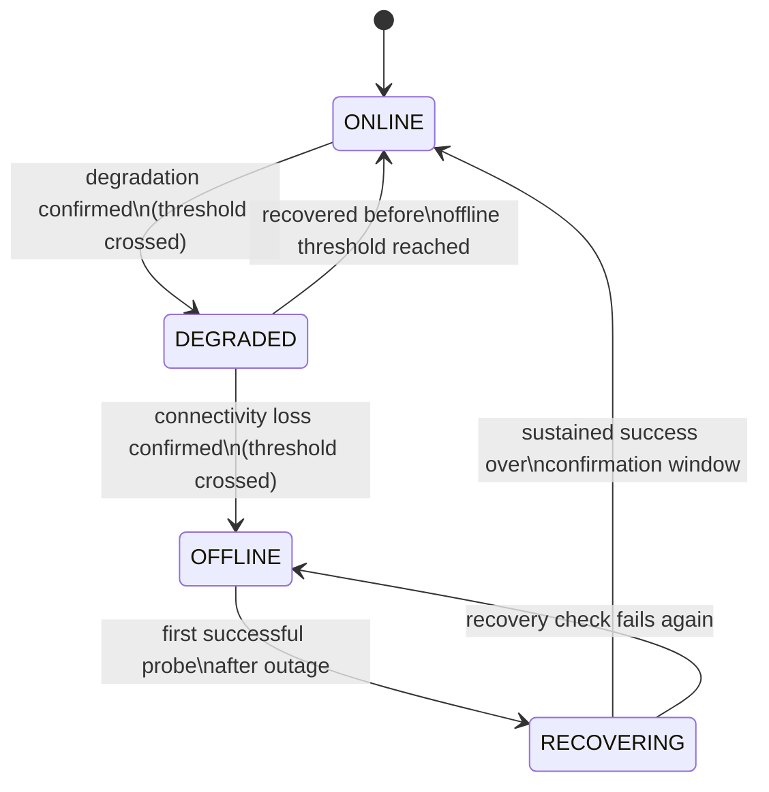
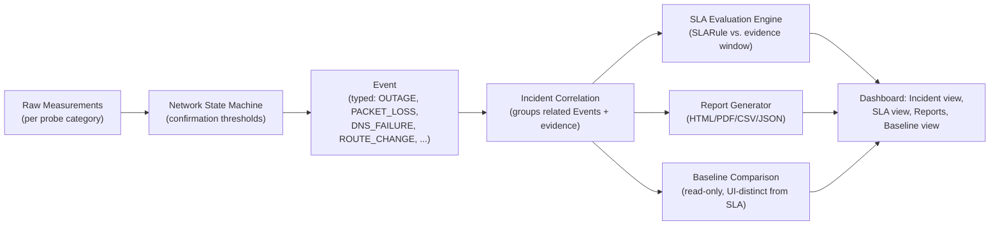

# State Machine & Incident Correlation

## Connectivity state machine

Raw probe failures/successes are never surfaced directly as an outage — they must cross a configurable
confirmation threshold first (consecutive failures, minimum duration, and/or number of independent
targets failing), per §19.

Editable source: [diagrams/state-machine.drawio](diagrams/state-machine.drawio).

Every transition is written to `NetworkStateLog` with the reason and the specific targets that
confirmed it — this is the evidence trail used later by incident reports.

## Event → Incident → SLA/Report flow

Editable source: [diagrams/incident-sla-flow.drawio](diagrams/incident-sla-flow.drawio).

## Correlation principles (§21)

- Simultaneous measurements across gateway / ISP first hop / Internet targets / DNS are correlated to
  produce different evidence for, e.g., "gateway healthy but Internet targets failing" vs. "gateway
  itself failing."
- The system never asserts definitive root cause. Incident descriptions use qualifying language:
  *"Observed"*, *"Consistent with"*, *"Potential"*, *"Unable to determine"*.
- All evidence used for a classification is stored (`EVENT_EVIDENCE` rows referencing specific
  measurement rows), so a human can independently review and disagree with the automated
  classification.

## Incident lifecycle

1. State machine transition (e.g. `ONLINE → DEGRADED`) creates an `Event`.
2. Related `Event`s (same time window, related targets/metrics) are grouped into an `Incident`.
3. While the `Incident` is open, new related `Event`s keep attaching to it.
4. On recovery confirmation (`RECOVERING → ONLINE`), the `Incident` is closed (`end_time`,
   `duration_seconds`, `recovery_status` set).
5. Closing an incident triggers report generation and SLA evaluation against the incident's evidence
   window (see [SLA_AND_BASELINES.md](SLA_AND_BASELINES.md) and
   [REPORTING_AND_RETENTION.md](REPORTING_AND_RETENTION.md)).
