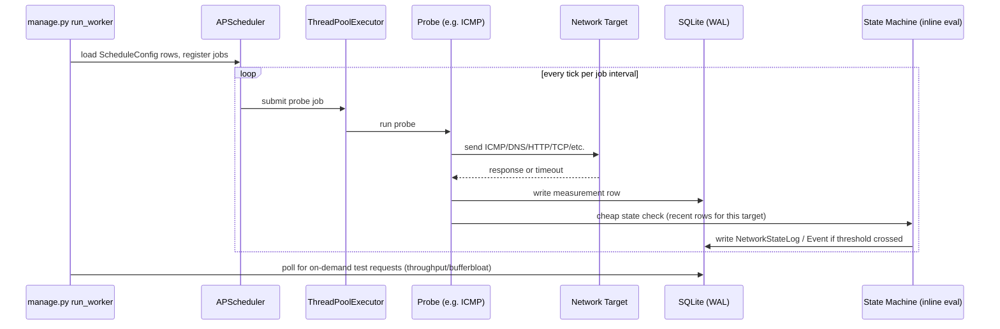

# Worker & Scheduling

## Why a separate process

Requirements §16 explicitly forbids running measurement loops inside Django request handlers, and
requires the measurement engine to keep running even when the web UI isn't open. A separate process
(`manage.py run_worker`) satisfies both: it has its own lifecycle, and Django views never block on
network I/O.

## Inside `run_worker`

Editable source: see [diagrams/architecture-overview.drawio](diagrams/architecture-overview.drawio) for
the component view; this sequence is documented here in Mermaid only (no separate `.drawio`, to avoid
maintaining two representations of the same flow).

## Scheduling tiers

Intervals are **not hard-coded** — they live in the `ScheduleConfig` table and are editable via the
Django admin/config UI without a code change (§17). Suggested defaults to seed on first run:

| Tier | Example probes | Suggested default interval |
|---|---|---|
| Frequent | gateway ping, ISP/Internet reachability, latency, packet loss | seconds–minutes |
| Moderate | DNS, HTTP/HTTPS, TCP, route sampling | minutes |
| Infrequent | route analysis, MTU/PMTUD, IPv4 vs IPv6 comparison | hours–daily |
| On-demand | throughput, bufferbloat, bidirectional saturation | manual trigger or scheduled window, with a configurable max duration/data cap |

## Concurrency & safety rules

- APScheduler uses a `ThreadPoolExecutor` sized to the number of concurrent probes so slow/blocked
  probes (e.g. a DNS timeout) don't delay unrelated jobs.
- A single **bandwidth-test mutex** (a DB flag or in-process lock) ensures throughput/bufferbloat tests
  never overlap each other or run concurrently with each other across triggers.
- Measurements captured while a load test is active are tagged (`load_test_active=true` or similar) so
  the incident engine doesn't misread induced latency/loss as ambient degradation.
- Each probe job is independent and idempotent — a failed/crashed job writes a failure-result row (or
  logs and skips) rather than crashing the scheduler process.

## On-demand triggers

The web UI cannot run probes itself. To trigger an on-demand throughput/bufferbloat test, it writes a
lightweight request row (or flag) to the database; the worker checks for pending requests each
scheduling tick and executes them under the bandwidth-test mutex.
